# Architecture

This document describes the system architecture and data flow of the T-Pot Honeypot Analyzer.

## System Overview

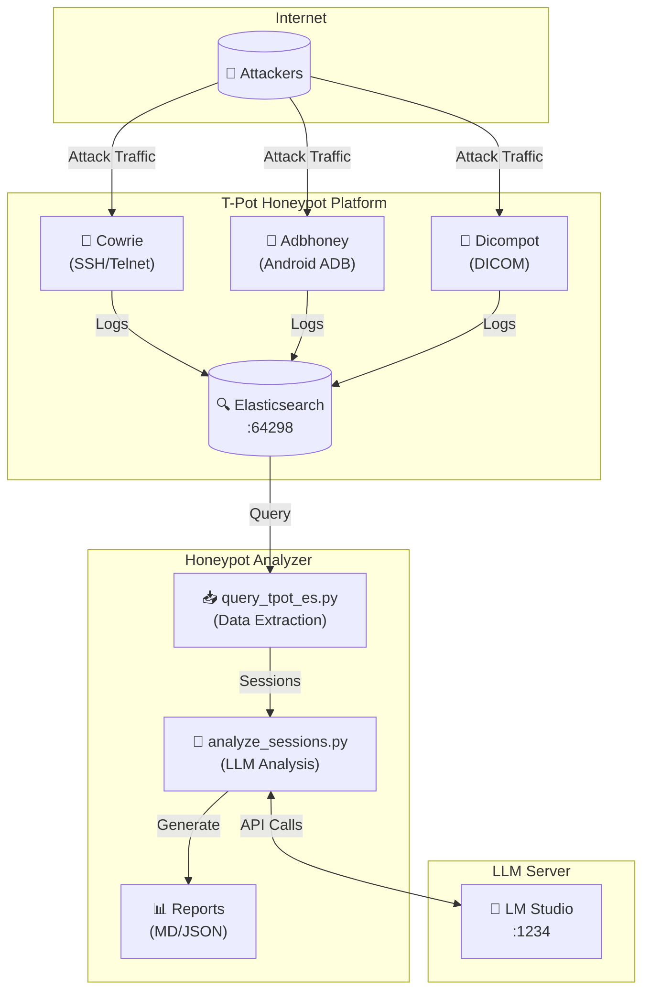

## Component Details

### T-Pot Platform

T-Pot is a multi-honeypot platform that captures attack traffic:

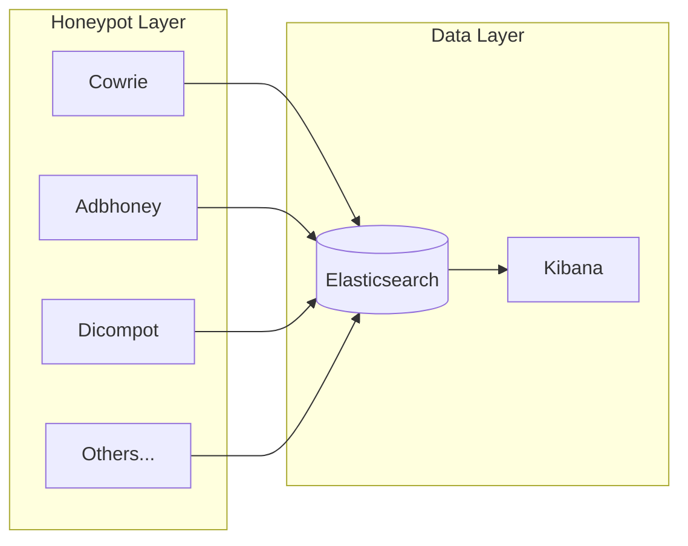

**Relevant Honeypots for This Tool:**

| Honeypot | Port | Captures |
|----------|------|----------|
| Cowrie | 22, 23 | SSH/Telnet shell commands |
| Adbhoney | 5555 | Android Debug Bridge commands |
| Dicompot | 11112 | DICOM protocol commands |

### Analyzer Pipeline

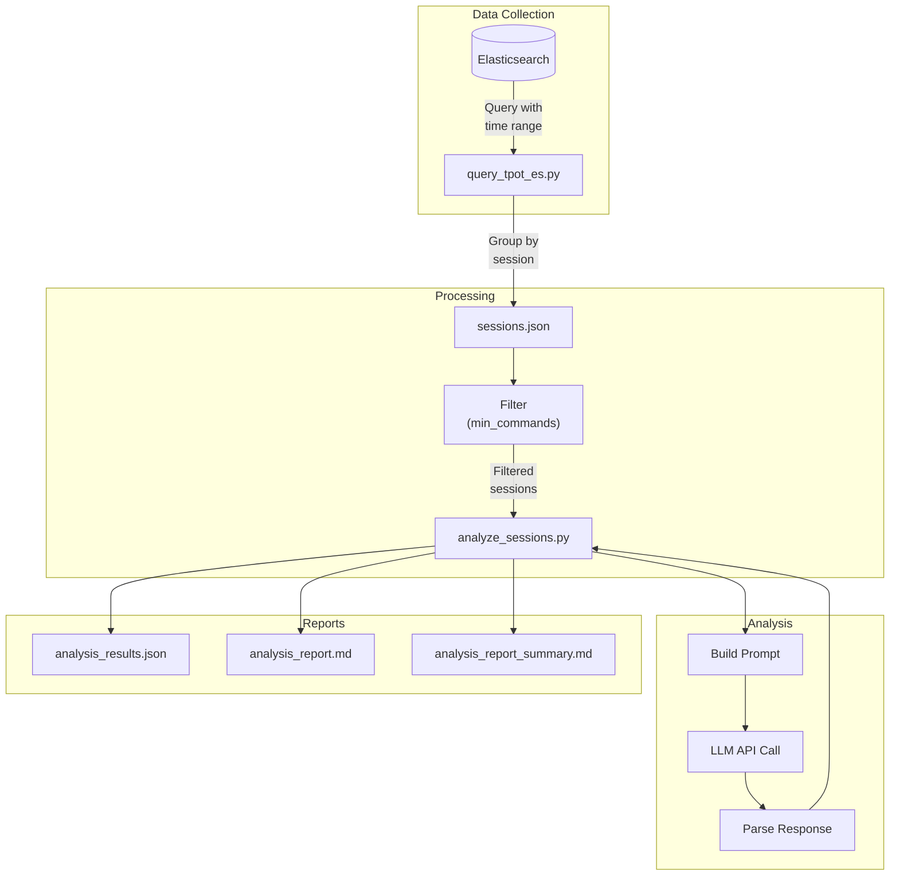

## Data Flow

### 1. Data Extraction (query_tpot_es.py)

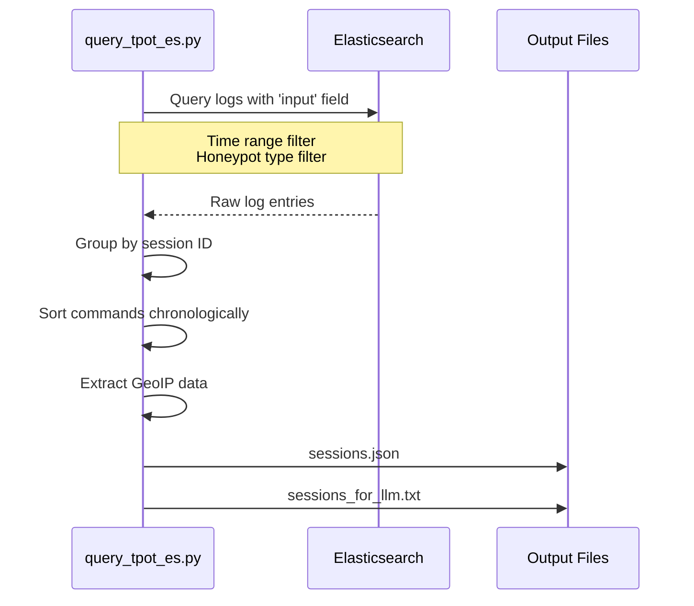

**Elasticsearch Query:**
```json
{
  "query": {
    "bool": {
      "must": [
        { "exists": { "field": "input" } },
        { "range": { "@timestamp": { "gte": "now-24h" } } }
      ],
      "must_not": [
        { "terms": { "type.keyword": ["Fatt", "Suricata", "P0f"] } }
      ]
    }
  }
}
```

### 2. LLM Analysis (analyze_sessions.py)

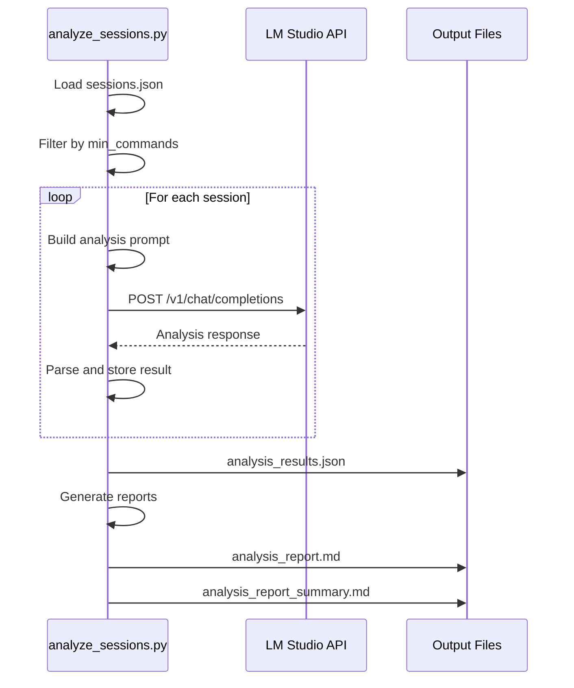

**LLM Prompt Structure:**
```
System: You are a cybersecurity analyst...

User: Analyze the following honeypot session...

SESSION INFORMATION:
- Session ID: abc123
- Honeypot Type: Cowrie
- Attacker IP: 1.2.3.4
- Commands: [list of commands]

Please provide analysis covering:
1. Attack Type
2. Objective
3. Techniques
4. IOCs
5. Threat Level
6. Summary
```

### 3. Parallel Processing

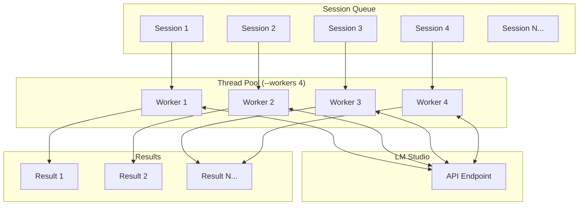

## File Structure

```
tpot-honeypot-analyzer/
│
├── run_analysis.py          # Orchestration entry point
│   └── Calls: query_tpot_es.py → analyze_sessions.py
│
├── query_tpot_es.py          # Elasticsearch data extraction
│   ├── Input: Elasticsearch query
│   └── Output: sessions.json, sessions_for_llm.txt
│
├── analyze_sessions.py       # LLM analysis engine
│   ├── Input: sessions.json
│   └── Output: analysis_results.json, *.md reports
│
├── config.py                 # Configuration loader
│   └── Loads: config.yml, .env, environment variables
│
├── explore_tpot_es.py        # Utility for ES exploration
│
├── config.yml                # User configuration (git-ignored)
├── config.example.yml        # Example configuration
├── requirements.txt          # Python dependencies
│
└── output/                   # Analysis results (git-ignored)
    ├── 20251216_162229/      # Timestamped run
    │   ├── sessions.json
    │   ├── sessions_for_llm.txt
    │   ├── analysis_results.json
    │   ├── analysis_report.md
    │   └── analysis_report_summary.md
    └── latest -> 20251216_162229
```

## Configuration Flow

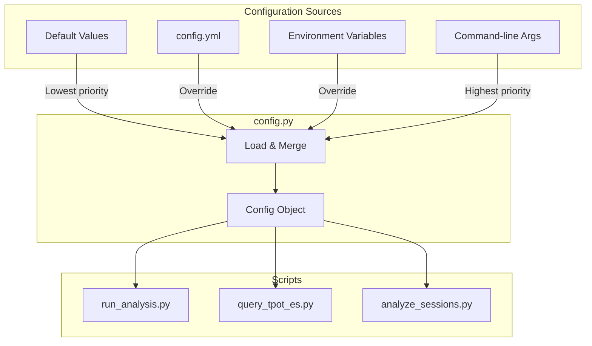

## Deployment Options

### Option 1: Same Machine as T-Pot

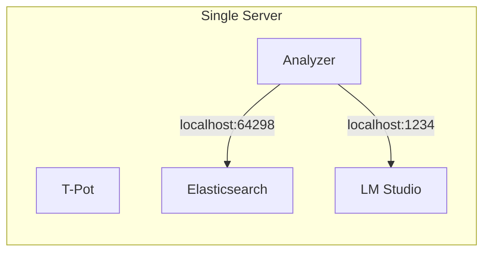

**Pros:** Simple setup, no network configuration
**Cons:** Resource competition, LLM needs GPU

### Option 2: Separate Analysis Server

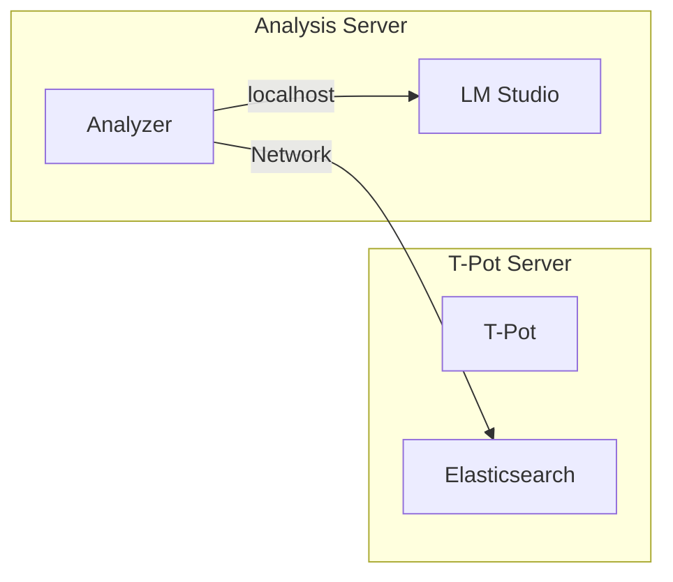

**Pros:** Isolated resources, dedicated GPU for LLM
**Cons:** Network latency, firewall configuration

### Option 3: Distributed

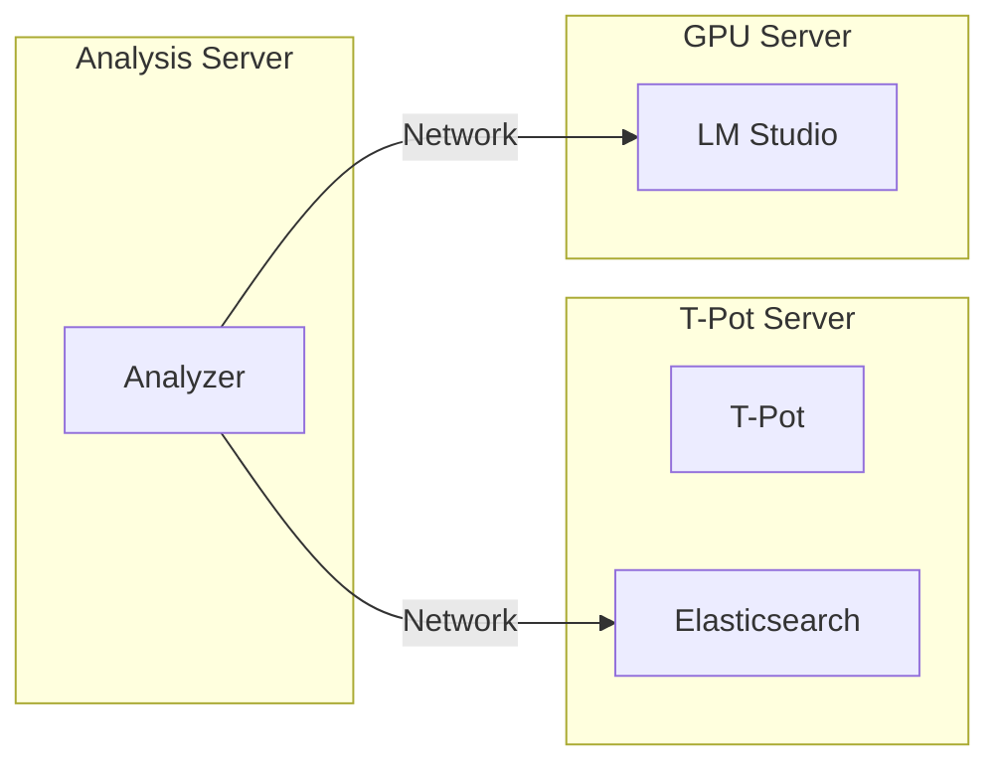

**Pros:** Maximum flexibility, scalable
**Cons:** Complex setup, multiple network hops

## Security Considerations

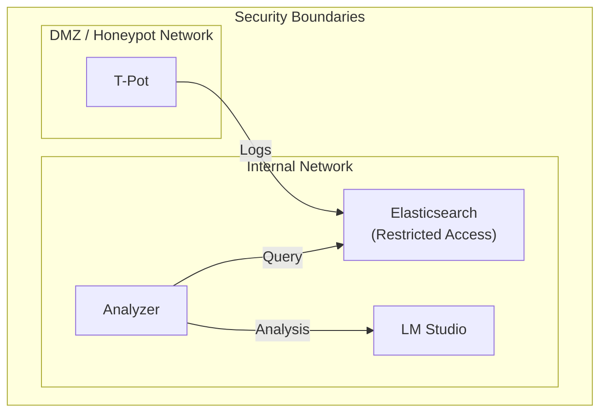

**Recommendations:**

1. **Elasticsearch Access**
   - Bind to internal interface only
   - Use firewall rules to restrict access
   - Consider authentication for production

2. **LLM Server**
   - Run locally when possible
   - Never expose to internet
   - Use API keys if remote

3. **Output Data**
   - Contains attacker commands and IOCs
   - Store securely
   - Share IOCs responsibly

## Scaling

### Horizontal Scaling (More Sessions)

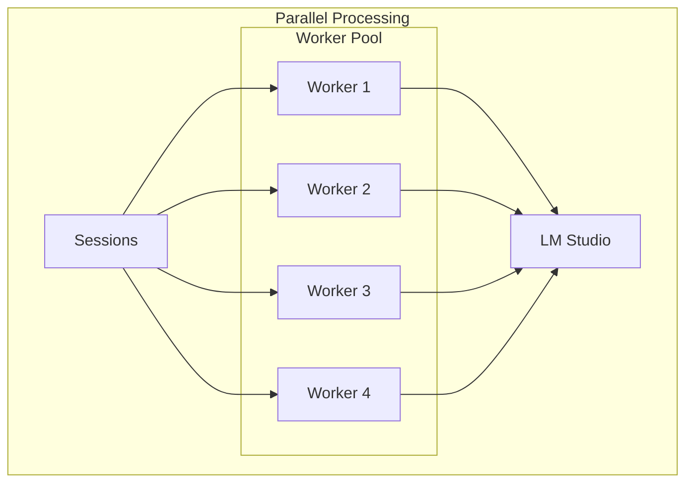

Use `--workers N` to parallelize LLM calls:
```bash
python run_analysis.py --workers 8
```

### Vertical Scaling (Faster LLM)

| Approach | Benefit |
|----------|---------|
| Larger GPU | Faster inference |
| Quantized models | Lower memory, faster |
| Smaller models | Trade quality for speed |
| Dedicated LLM server | No resource contention |
